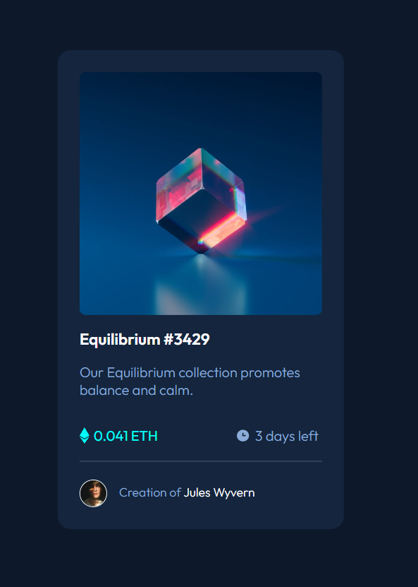

# Frontend Mentor - NFT preview card component solution

This is a solution to the [NFT preview card component challenge on Frontend Mentor](https://www.frontendmentor.io/challenges/nft-preview-card-component-SbdUL_w0U). Frontend Mentor challenges help you improve your coding skills by building realistic projects. 

## Table of contents

- [Overview](#overview)
  - [The challenge](#the-challenge)
  - [Screenshot](#screenshot)
  - [Links](#links)
- [My process](#my-process)
  - [Built with](#built-with)
  - [What I learned](#what-i-learned)
  - [Continued development](#continued-development)
- [Author](#author)

## Overview

### The challenge

Users should be able to:

- View the optimal layout depending on their device's screen size
- See hover states for interactive elements

### Screenshot

### Links

- Solution URL: [link](https://github.com/codebyveronica/NFT-preview-card-component)
- Live Site URL: [link](https://codebyveronica.github.io/NFT-preview-card-component/)

## My process

### Built with

- Semantic HTML5 markup
- CSS custom properties

### What I learned

I learned some new uses of CSS properties, such as opacity, to create a hover effect over the project image

### Continued development

I want to start learning more complex ways to apply CSS and create prettier styles, but I also need to keep learning and fixing the basics.

## Author

- Frontend Mentor - [@codebyveronica](https://www.frontendmentor.io/profile/codebyveronica)
